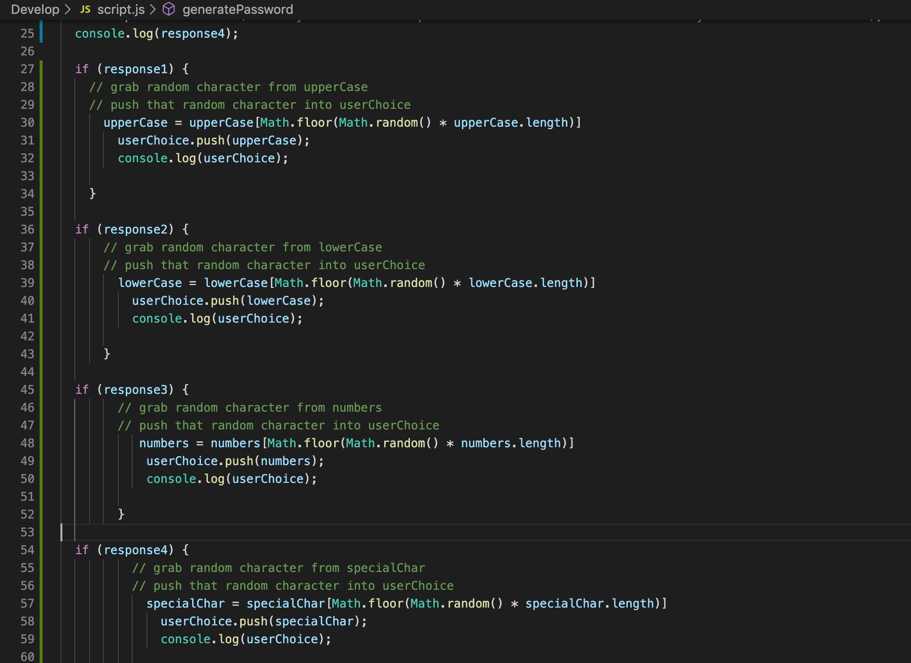
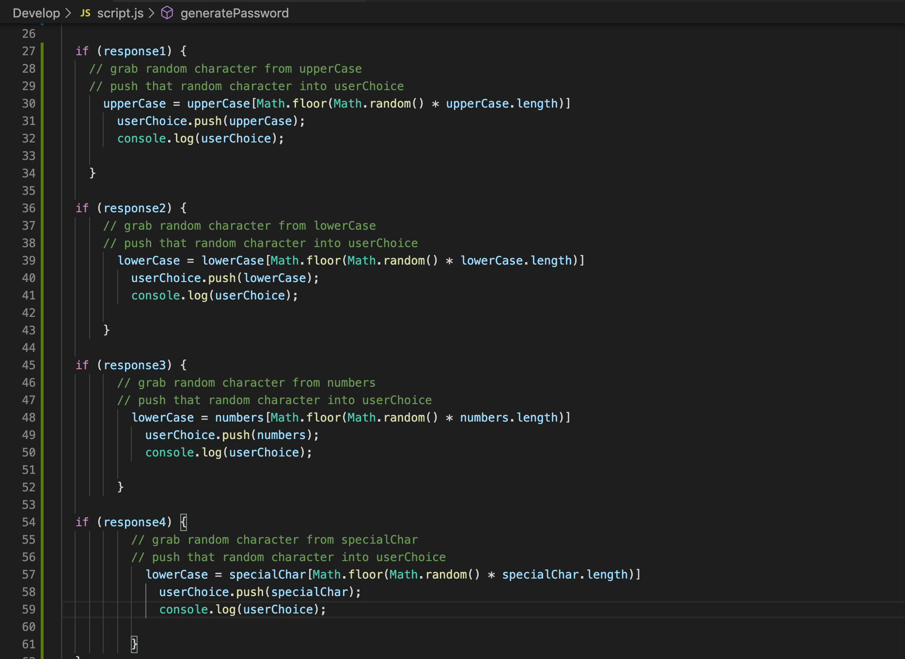
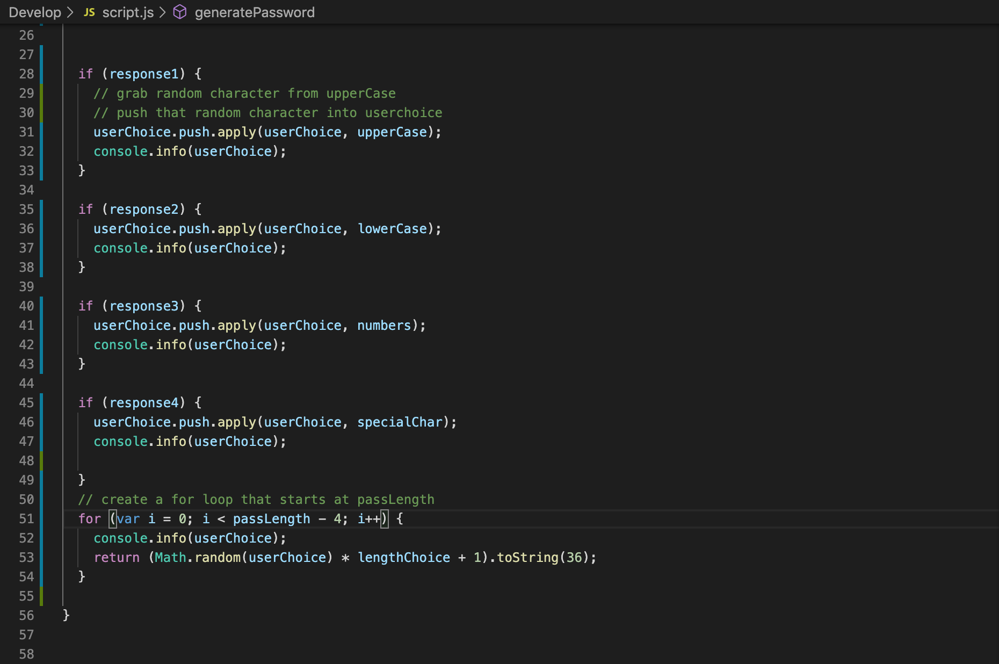
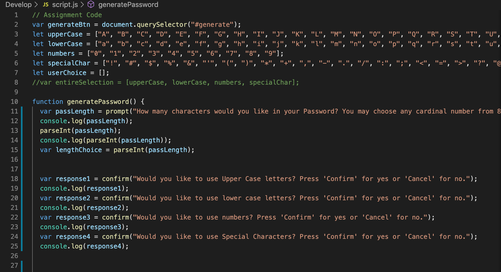

# Password-Generator-HW

I'll start by adding some screenshots of the code in progress.

This code went through many iterations. The above screenshots are only a snippet of the process. The goal of the code is to generate a random password according to the user's chosen criteria. The user's choice consists of password length (a number between 8 and 128), then whether the user wishes to use upper case letters, lower case letters, numbers, and/or special characters. The final result is meant to employ the specifications of the user. 

The code begins by a) mapping out variables that are arrays; 
it then b) goes through a series of prompts and confirms querying the user for information; 
next c) it captures the user's information by having those prompts and confirms being variables; 
after this d) the code moves through a series of "if" statements applying the user's choices;
finally e) a "for loop" is used to generate the random criteria.

